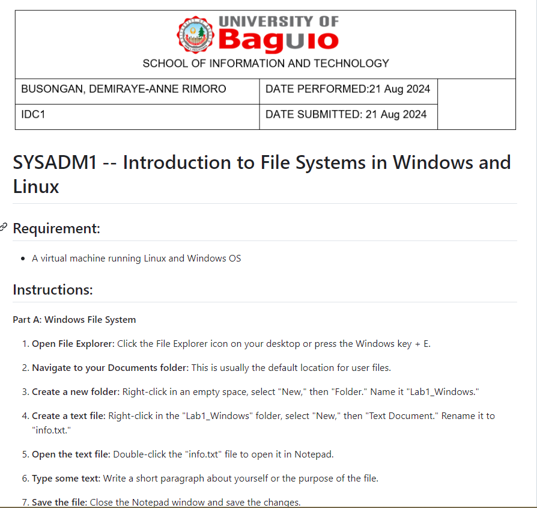
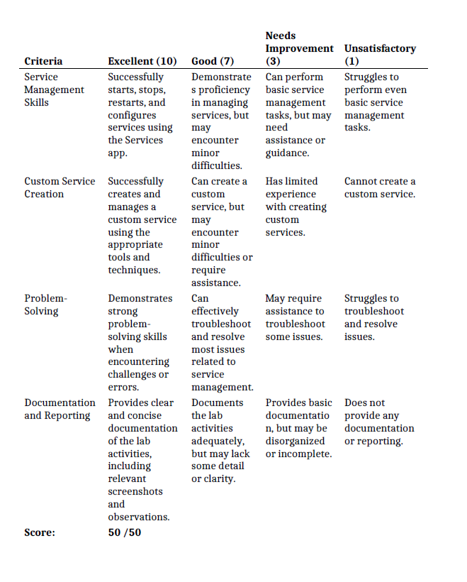
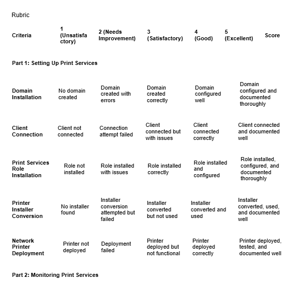
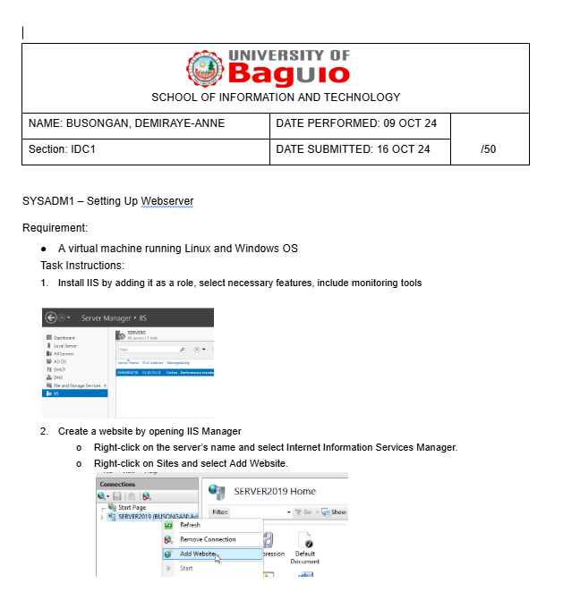
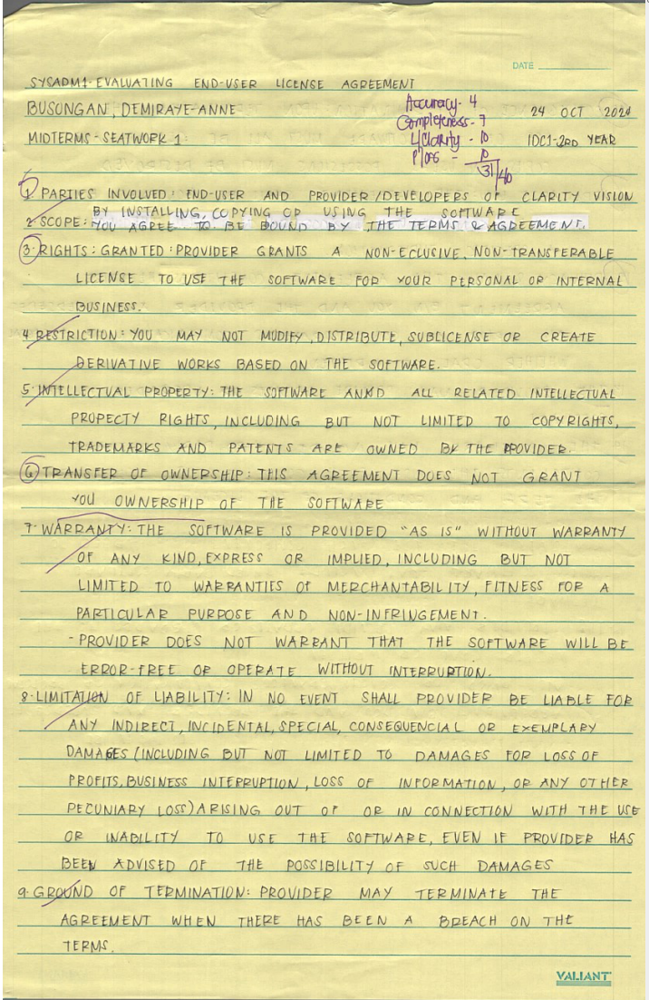
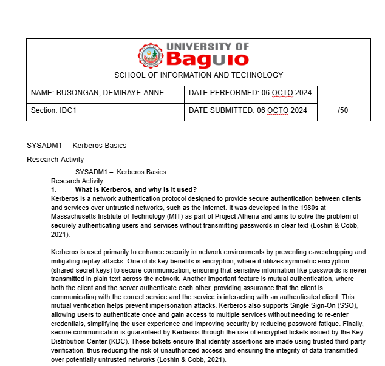
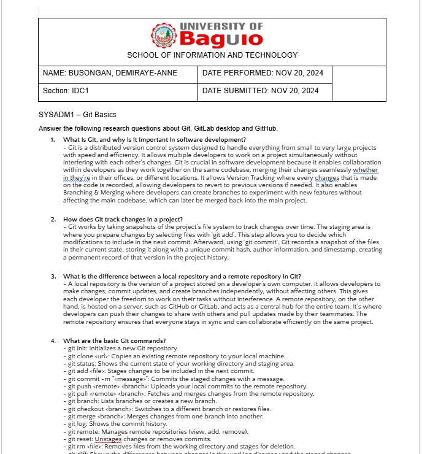
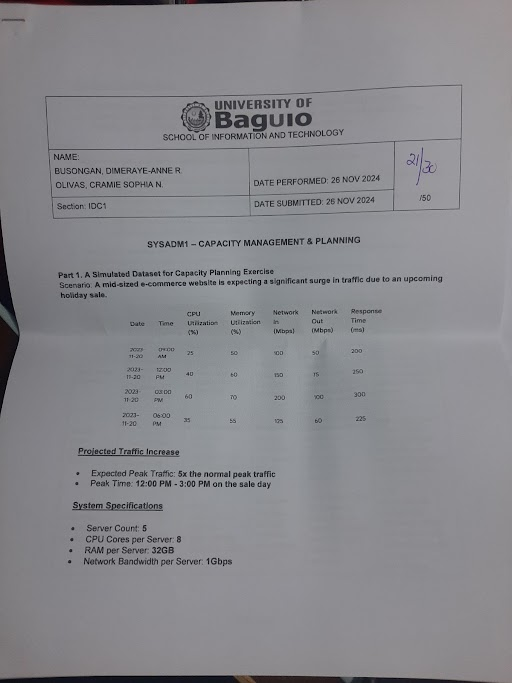

# SYSADM1 PORTFOLIO
## Submitted by : Busongan, Demiraye
> ## **Table of Contents**
| Name of Activity | Date | Image No. |
| --- | --- | --- |
| **First Grading** |
| Laboratory Activities |  |  |
| FGE_LW1 Creating File System | 28 AUG |  |
| FGE_LW3 Managing Services in Windows | 28 AUG |  |
| FGE_LW4 Managing Services in Linux | 11 SEPT |  |
| **Midterm** |
| Laboratory Activities |  |  |
| M_LW1 Print Services | 25 SEPT |  |
| M_LW2 Web Server | 24 OCTO |  |
| MID_SLA | 24 OCTO |  |
| **Final Grading** |
| Laboratory Activities |  |  |
| F_LW1 Kerberos Research | 06 NOV |  |
| F_LW1 Kerberos Laboratory | 13 NOV |  |
| F_LW2 Git | 20 NOV |  |
| Network Design | 04 DEC |  ||

> ## Screenshots of Activities
| Name of Activity | SS | Image No. |  File Link  |
| --- | --- | --- | --- |
| Prelims Laboratory Activities |  |  |  |
| FGE_LW1 Creating File System | |  | [View FGE_LW1](Prelim/FGE_LW1%20Creating%20File%20Systems.md) |
| FGE_LW3 Managing Services in Windows | |  | [View FGE_LW3](Prelim/FGE_LW3%20Managing%20Services%20in%20Windows.md)  |
| FGE_LW4 Managing Services in Linux   |  |  | [View FGE_LW4](Prelim/FGE_LW4%20Managing%20Services%20in%20Linux.md)  |
| Midterms Laboratory Activities |  |  |  |
| M_LW1 Print Services         |  |  | [View M_LW1](Midterm/M_LW1%20Print%20Services.md) |
| M_LW2 Web Server             |  |  | [View M_LW2](Midterm/M_LW2%20Web%20Server.md) |
| MID_SLA |  |  | [View MID_SLA](Midterm/MID_SLA.md) |
| Final Laboratory Activities |  |  |  |
| F_LW1 Kerberos Research |  |  | [View FLW1 Research](Midterm/FLW1_Kerberos-Research.md) |
| F_LW1 Kerberos Laboratory | _UBUNTU.png) |  | [View FLW1 Laboratory](Midterm/FLW1_Kerberos(1)_UBUNTU.md) |
| FLW2 Git |  |  | [View FLW2 Git](Midterm/FLW2 Git.md) |
| FLW3 Capacity Planning |  |  | [View FLW3](Midterm/FLW3_Capacity%20Planning.md) |

> ## **Course Reflection**

What were your initial expectations for the course? Did the course meet,
exceed, or fall short of these expectations?

  -----------------------------------------------------------------------

  -----------------------------------------------------------------------

What were the main topics or concepts covered in the course? How did
these topics contribute to your understanding of the subject matter?

  -----------------------------------------------------------------------

  -----------------------------------------------------------------------

Reflecting on your learning process, what were the most effective
strategies or techniques that helped you grasp and retain the course
material?

  -----------------------------------------------------------------------

  -----------------------------------------------------------------------

Were there any particular assignments, projects, or activities that
significantly enhanced your learning experience? Why were they
effective?

  -----------------------------------------------------------------------

  -----------------------------------------------------------------------

Did you encounter any challenges or difficulties during the course? How
did you overcome these obstacles, and what did you learn from them?

  -----------------------------------------------------------------------

  -----------------------------------------------------------------------

Did the course encourage critical thinking and analysis? How did it
promote higher-order thinking skills, such as problem-solving or
decision-making?

  -----------------------------------------------------------------------

  -----------------------------------------------------------------------

Reflecting on your personal growth, what new knowledge, skills, or
perspectives did you gain from this course?

  -----------------------------------------------------------------------

  -----------------------------------------------------------------------

How do you plan to apply what you have learned in this course to your
future studies, career, or personal life?

  -----------------------------------------------------------------------

  -----------------------------------------------------------------------
